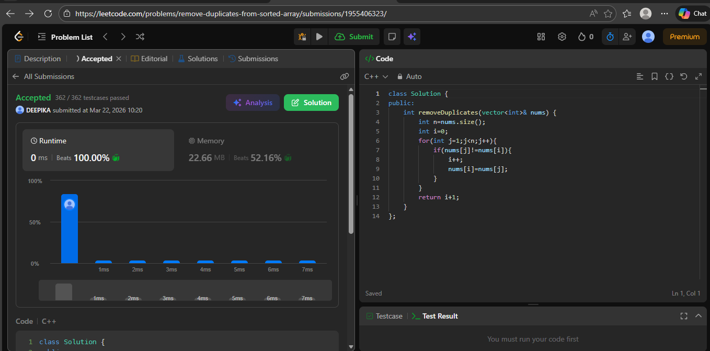

# DAY 1
## PROBLEM 
LEETCODE-26 --> Remove Duplicates from Sorted Array
## Approach 
use i and j and compare by iterating through the array and if 
elements not equal so move i and nums[i]=nums[j] at last return i+1 total unique elements.
## screenshot
